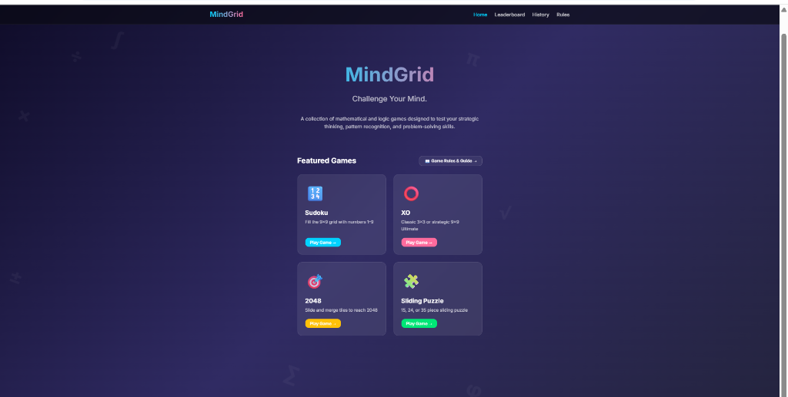
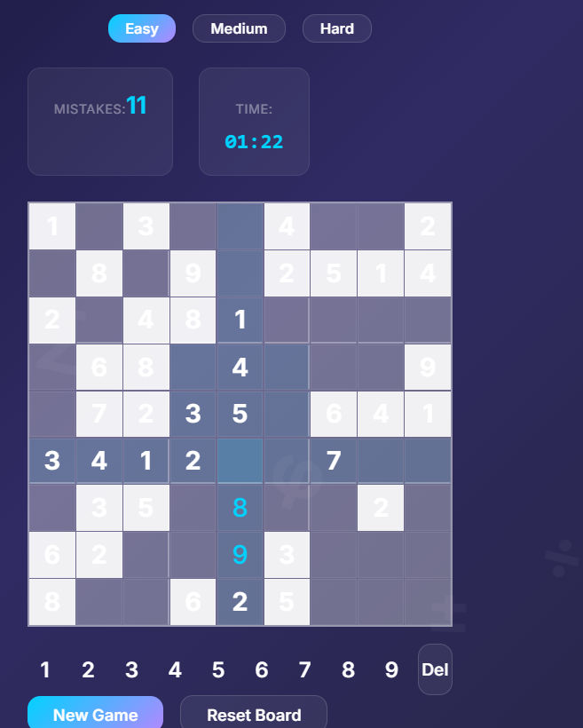
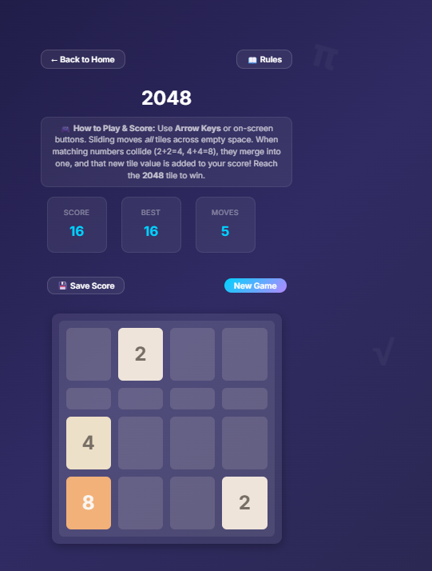
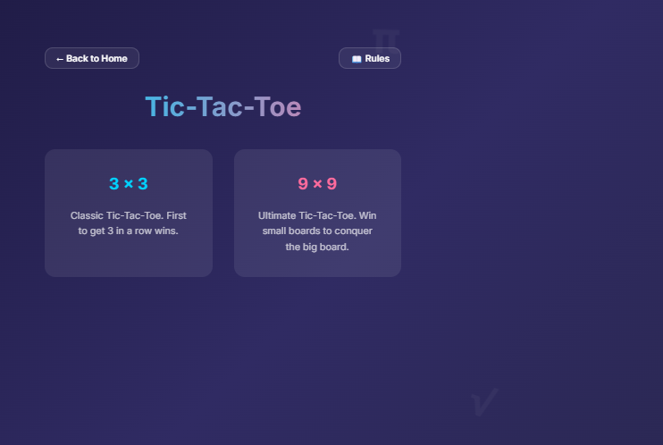
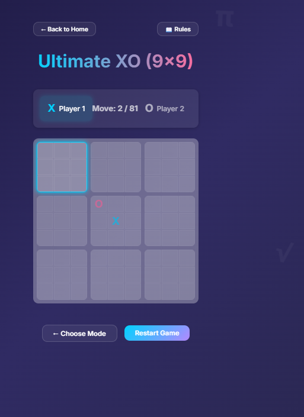
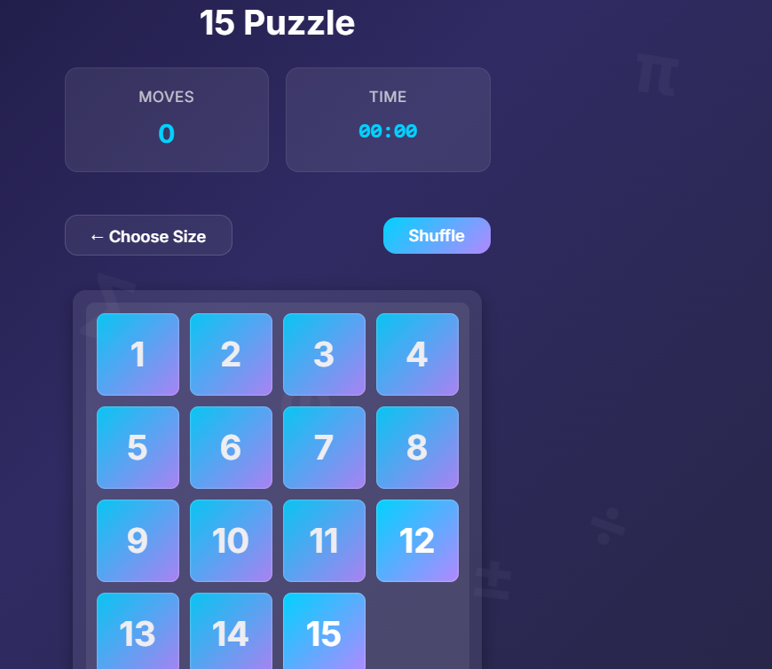
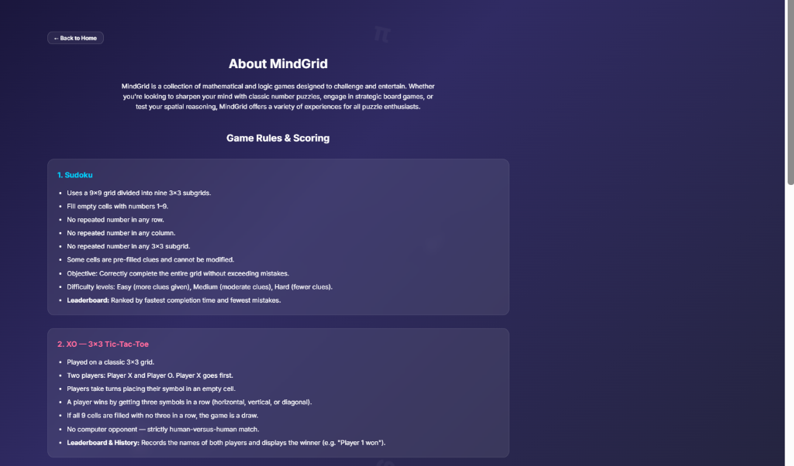
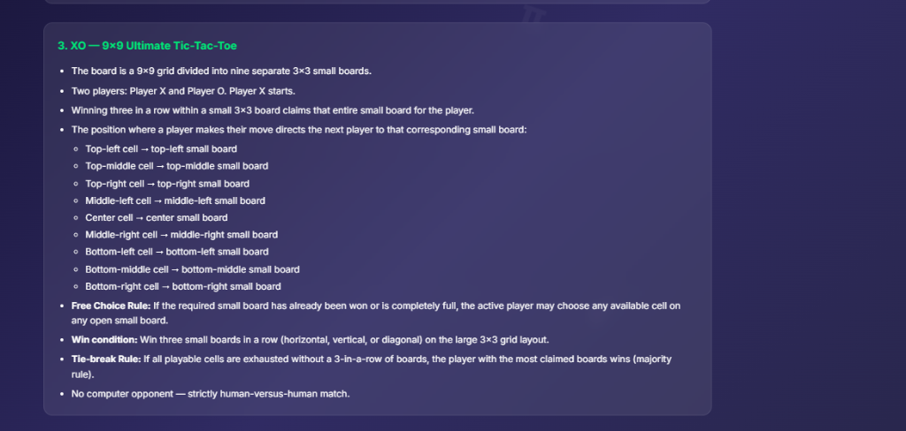
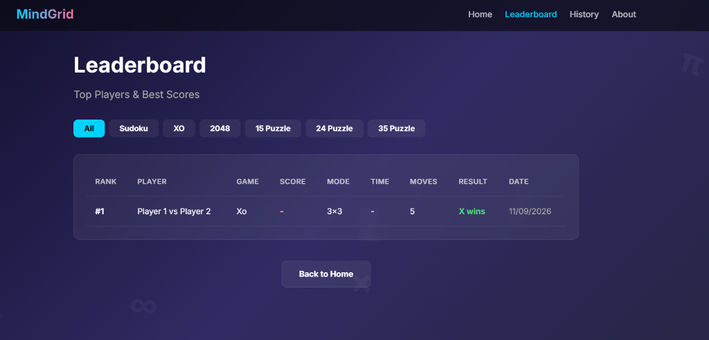
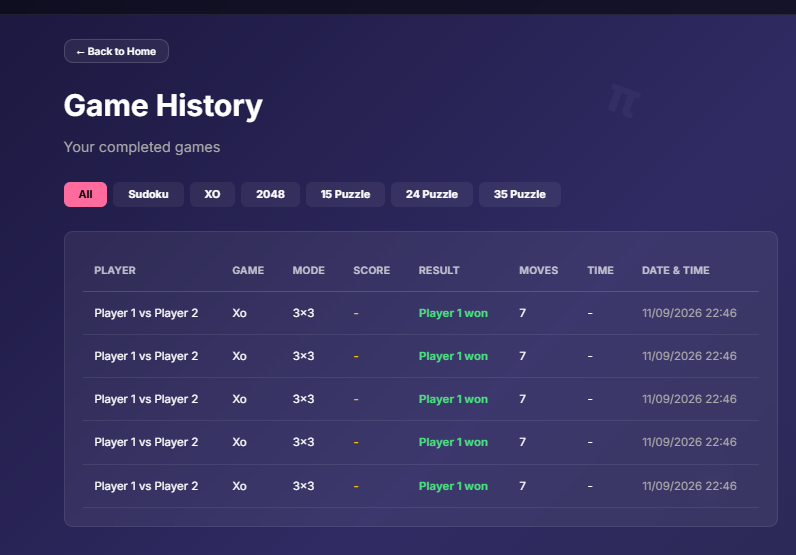

# MindGrid 🧠

**MindGrid** is a modern, clean, and responsive web platform featuring a curated suite of mathematical, spatial, and strategic logic puzzles. Built with Next.js, React, TypeScript, and a sleek dark-mode glassmorphic design system.

---

## 🔗 Live Demo & Links

- 🌐 **Live Website:** [mindgrid-madesh-sky.vercel.app](https://mindgrid-madesh-sky.vercel.app) 
- 💻 **GitHub Repository:** [https://github.com/Madesh-sky/mindgrid](https://github.com/Madesh-sky/mindgrid)
- 📹 **Demo Video:** https://drive.google.com/file/d/1WAmxiULrQyiBkgFbaIR2NxUxZE0m3fXB/view?usp=sharing

---

## 📸 Screenshots & Showcase

### 1. Home Page & Game Suite


---

### 2. Sudoku & 2048
| Sudoku (9×9 with Rule Validation) | 2048 Tile Merging |
|:---:|:---:|
|  |  |

---

### 3. Tic-Tac-Toe (Classic 3×3 & Ultimate 9×9)
| Mode Selection | Ultimate XO (9×9 Meta-Board) |
|:---:|:---:|
|  |  |

---

### 4. Sliding Puzzles & Game Rules Guide
| 15 / 24 / 35 Sliding Puzzles | Rules Overview |
|:---:|:---:|
|  |  |

| Ultimate XO Rules & Mechanics |
|:---:|
|  |

---

### 5. Leaderboard & Match History
| Real-time Leaderboard | Detailed Match History |
|:---:|:---:|
|  |  |

---

## 🎮 Included Games

1. **Sudoku (9×9)**
   - Classic 9×9 number placement challenge with Easy, Medium, and Hard difficulties.
   - Realistic rule-conflict mistake detection (checks for duplicate values in rows, columns, and 3×3 subgrids).
   - Real-time timer and completion tracker.

2. **XO — 3×3 Classic Tic-Tac-Toe**
   - Head-to-head two-player grid match.
   - Customizable player names with active turn indicators and move tracking.

3. **XO — 9×9 Ultimate Tic-Tac-Toe**
   - Two-player strategic meta-grid game.
   - Moves in small 3×3 boards dictate where the next player must play.
   - Includes full territory capturing, free-choice routing, and tie-break majority rules.

4. **2048**
   - Dynamic 4×4 tile-sliding puzzle.
   - Arrow keys, WASD, and touch/on-screen control buttons.
   - Accurate score calculation (+value of newly merged tiles) and high-score tracking.

5. **Sliding Puzzles**
   - **15 Puzzle (4×4)**: 15 numbered tiles + 1 empty space.
   - **24 Puzzle (5×5)**: 24 numbered tiles + 1 empty space.
   - **35 Puzzle (6×6)**: 35 numbered tiles + 1 empty space.
   - Guaranteed solvable initial shuffles with move and timer counters.

---

## ✨ Key Features

- **🏆 Dynamic Leaderboards**: Ranks top scores, fastest times, and fewest moves across all game modes.
- **📜 Detailed Game History**: Automatically logs completed matches, scores, player names, dates, and results.
- **🛡️ Offline-Resilient Storage**: Zero setup required—scores and match history are saved locally and automatically sync to MongoDB whenever connected.
- **📖 Comprehensive Game Rules Guide**: In-depth rules, collision mechanics, and scoring breakdowns accessible from any game.
- **📱 Fully Responsive**: Optimized for desktop keyboards and mobile touchscreens.

---

## 🛠️ Technology Stack

- **Framework**: [Next.js 14 / 16 (App Router)](https://nextjs.org/)
- **Frontend**: [React](https://react.dev/), TypeScript, CSS Modules
- **State Management**: React Hooks (`useState`, `useEffect`, `useCallback`, `useRef`)
- **Database & Storage**: [MongoDB](https://www.mongodb.com/) with [Mongoose](https://mongoosejs.com/) + Automatic Client-Side LocalStorage Fallback
- **Styling**: Modern CSS3 Custom Properties & Glassmorphism Design System

---

## 🚀 Getting Started Locally

### 1. Clone the Repository

```bash
git clone https://github.com/Madesh-sky/mindgrid.git
cd mindgrid
```

### 2. Install Dependencies

```bash
npm install
```

### 3. Configure Environment Variables (Optional)

Copy the `.env.example` file to `.env.local`:

```bash
cp .env.example .env.local
```

Edit `.env.local` to specify your MongoDB connection string if desired:

```env
MONGODB_URI=mongodb://localhost:27017/mindgrid
```

*(Note: MindGrid works seamlessly without a running database by utilizing browser local storage).*

### 4. Run the Development Server

```bash
npm run dev
```

Open [http://localhost:3000](http://localhost:3000) in your browser.

---

## 📦 Production Build

```bash
# Create production build
npm run build

# Start production server
npm start
```

---

## 📄 License

MIT License. Open source and free to use.
